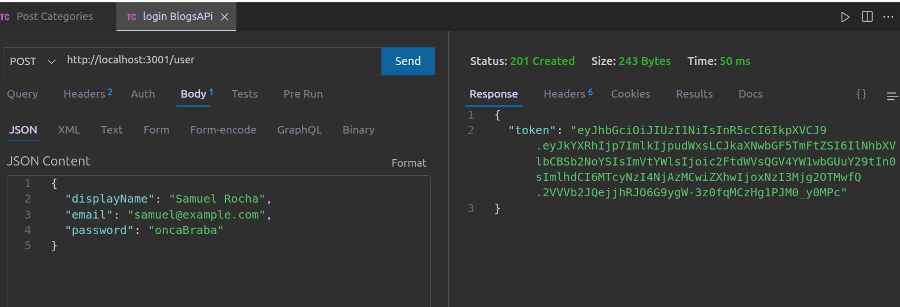
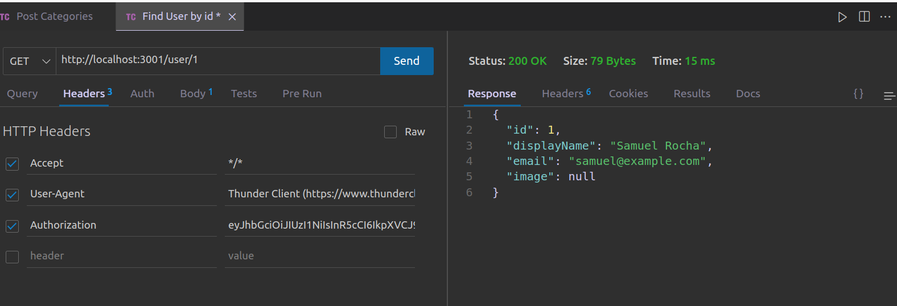
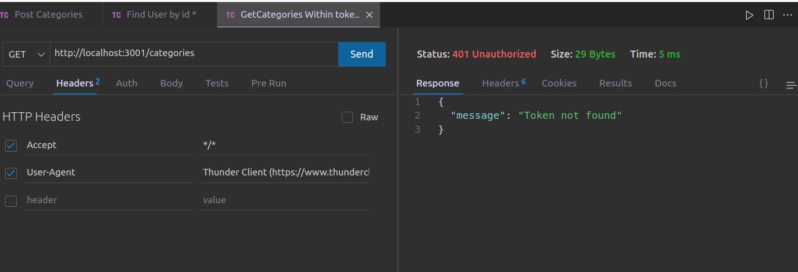

#  Blogs API 

## 🌐 [](https://github.com/SamuelRocha91/BlogsApi/blob/main/README.md) [](https://github.com/SamuelRocha91/BlogsApi/blob/main/README_es.md) [](https://github.com/SamuelRocha91/BlogsApi/blob/main/README_en.md) [](https://github.com/SamuelRocha91/BlogsApi/blob/main/README_ru.md) [](https://github.com/SamuelRocha91/BlogsApi/blob/main/README_ch.md) [](https://github.com/SamuelRocha91/BlogsApi/blob/main/README_ar.md)

 


<details>
  <summary><h2>📜 描述</h2></summary>

  这是一个评估项目，作为 Trybe 网络开发课程后端模块的一部分。该项目由一个简单的 API 组成，是我学习初期开发的，使用了 Node.js、Sequelize、Docker 和 MSC（模型、服务、控制器）架构。项目的目标是创建一个 RESTful API，以管理博客中的发布，包括用户的身份验证和验证。

</details>

<details>
  <summary><h2>🛠️ 功能</h2></summary>

  - **用户身份验证：** 用户可以注册、登录并获取其个人资料信息。身份验证通过 JWT 令牌进行。
  - **发布类别：** API 允许创建和显示类别以组织发布。
  - **发布的 CRUD 操作：** 已身份验证的用户可以创建、显示、更新和删除发布。
  - **分层架构（MSC）：** 项目遵循 MSC 架构，分离业务逻辑（服务）、管理逻辑（控制器）和数据库交互（模型）。
  - **中间件：** 用于验证输入数据和身份验证路由。

</details>

<details>
  <summary><h2>🔧 使用的技术</h2></summary>

  - **Node.js：** 用于后端开发的平台。
  - **Express：** 用于创建路由和中间件的 web 框架。
  - **Sequelize：** 用于建模和与 MySQL 数据库交互的 ORM。
  - **MySQL：** 关系型数据库。
  - **JWT（JSON Web Token）：** 用于用户身份验证。
  - **Docker：** 用于容器化应用程序，简化开发环境。
  - **Jest：** 测试框架，用于确保代码质量。

</details>

<details>
  <summary><h2>📋 要求</h2></summary>

  - **Node.js** 版本 16.x
  - **Docker** 和 **Docker Compose**
  - **MySQL**

</details>

<details>
  <summary><h2>⚙️ 安装</h2></summary>

  1. 克隆代码库：
     ```bash
     git clone https://github.com/seu-usuario/blogs-api.git
     cd blogs-api
     ```

  2. 根据 `.env.example` 创建 `.env` 文件：
     ```bash
     cp env.example .env
     ```

  3. 启动 Docker 容器：
     ```bash
     docker-compose up -d
     ```

  4. 执行迁移并创建数据库：
     ```bash
     docker exec -it blogs_api /bin/sh
     npm run prestart
     ```

  5. 填充数据库的初始数据（如果需要）：
     ```bash
     npm run seed
     ```

</details>

<details>
  <summary><h2>📡 路由</h2></summary>

  API 具有以下路由：

  ### 用户
  - `POST /login`：用户身份验证。
  - `POST /user`：注册新用户。
  - `GET /user`：返回注册的用户（需要身份验证）。
  - `GET /user/:id`：按 ID 返回用户（需要身份验证）。

  ### 类别
  - `POST /categories`：注册新类别（需要身份验证）。
  - `GET /categories`：返回所有类别的列表（需要身份验证）。

  ### 发布
  - `POST /post`：注册新发布（需要身份验证）。

</details>

<details>
  <summary><h2>📂 目录结构</h2></summary>

  - **/src**：包含应用程序的所有源代码。
    - **/controllers**：负责处理请求和发送响应的路由控制器。
    - **/middlewares**：用于数据验证和身份验证的中间件。
    - **/models**：使用 Sequelize 定义表和与数据库交互。
    - **/services**：包含业务逻辑。

</details>

<details>
  <summary><h2>📜 脚本</h2></summary>

  - `npm run prestart`：创建数据库并执行迁移。
  - `npm run seed`：填充数据库的初始数据。
  - `npm run start`：启动应用程序。
  - `npm run dev`：使用 `nodemon` 启动开发模式下的应用程序。
  - `npm test`：使用 Jest 执行测试。

</details>

<details>
  <summary><h2>🐳 Docker</h2></summary>

  应用程序完全通过 Docker 容器化。要启动环境，请使用：

  ```bash
  docker-compose up -d
  docker exec -it blogs_api /bin/sh
  npm run prestart
  npm start
  ```

</details>

<details>
  <summary><h2>🔗 其他项目</h2></summary>

  - ⚽ [Typescript FootBall API](https://github.com/SamuelRocha91/trybeFutebolClube/blob/main/README_ch.md)
  - 🐉 [Trybers and Dragons](https://github.com/SamuelRocha91/trybeAndDragons/blob/main/README_ch.md)
  - 🗡️ [Trybe Smith](https://github.com/SamuelRocha91/TrybeSmith/blob/main/README_ch.md)

</details>
