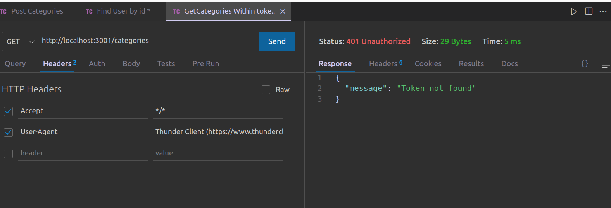

#  Blogs API 

## üåê [](https://github.com/SamuelRocha91/BlogsApi/blob/main/README.md) [](https://github.com/SamuelRocha91/BlogsApi/blob/main/README_es.md) [](https://github.com/SamuelRocha91/BlogsApi/blob/main/README_en.md) [](https://github.com/SamuelRocha91/BlogsApi/blob/main/README_ru.md) [](https://github.com/SamuelRocha91/BlogsApi/blob/main/README_ch.md) [](https://github.com/SamuelRocha91/BlogsApi/blob/main/README_ar.md)

 


This is an assessment project developed as part of the BackEnd module of Trybe's Web Development course. The project is a simple API built early in my studies, using Node.js, Sequelize, Docker, and the MSC (Model, Service, Controller) architecture. The goal was to create a RESTful API to manage blog posts, including user authentication and validation.

## Features

- **User Authentication:** Users can register, log in, and get information about their profiles. Authentication is done using JWT tokens.
- **Post Categories:** The API allows the creation and listing of categories to organize posts.
- **CRUD of Posts:** Authenticated users can create, list, update, and delete posts.
- **Layered Architecture (MSC):** The project follows the MSC architecture, separating business logic (services), control logic (controllers), and database interactions (models).
- **Middlewares:** Used for input validation and route authentication.

## Technologies Used

- **Node.js:** Backend development platform.
- **Express:** Web framework for creating routes and middlewares.
- **Sequelize:** ORM used to model and interact with the MySQL database.
- **MySQL:** Relational database.
- **JWT (JSON Web Token):** Used for user authentication.
- **Docker:** For containerizing the application, simplifying the development environment.
- **Jest:** Testing framework used to ensure code quality.

## Requirements

- **Node.js** version 16.x
- **Docker** and **Docker Compose**
- **MySQL**

## Installation

1. Clone the repository:
   ```bash
   git clone https://github.com/your-username/blogs-api.git
   cd blogs-api
   ```

2. Create the `.env` file based on the `.env.example`:
   ```bash
   cp env.example .env
   ```

3. Start the Docker containers:
   ```bash
   docker-compose up -d
   ```

4. Run the migrations and create the database:
   ```bash
   docker exec -it blogs_api /bin/sh
   npm run prestart
   ```

5. Populate the database with initial data (if necessary):
   ```bash
   npm run seed
   ```

## Routes

The API provides the following routes:

### Users
- `POST /login`: Authenticates a user.
- `POST /user`: Registers a new user.
- `GET /user`: Returns registered users (authentication required).
- `GET /user/:id`: Returns a user by ID (authentication required).

### Categories
- `POST /categories`: Creates a new category (authentication required).
- `GET /categories`: Lists all categories (authentication required).

### Posts
- `POST /post`: Creates a new post (authentication required).

## Folder Structure

- **/src**: Contains all application source code.
  - **/controllers**: Route controllers responsible for handling requests and sending responses.
  - **/middlewares**: Middlewares used for data validation and authentication.
  - **/models**: Table definitions and database interactions using Sequelize.
  - **/services**: Contains business logic.

## Scripts

- `npm run prestart`: Creates the database and runs migrations.
- `npm run seed`: Populates the database with initial data.
- `npm run start`: Starts the application.
- `npm run dev`: Starts the application in development mode with `nodemon`.
- `npm test`: Runs the tests using Jest.

## Docker

The application is fully containerized with Docker. To start the environment, use:

```bash
docker-compose up -d
docker exec -it blogs_api /bin/sh
npm run prestart
npm start
```

## Other Projects

- ⚽ [Typescript FootBall API](https://github.com/SamuelRocha91/trybeFutebolClube/blob/main/README_en.md)
- 🐉 [Trybers and Dragons](https://github.com/SamuelRocha91/trybeAndDragons/blob/main/README_en.md)
- 🌶️ [Recipes App](https://github.com/SamuelRocha91/ProjectRecipesApp/blob/main/README_en.md)
- 🐣 [Pokedex](https://github.com/SamuelRocha91/pokedex/blob/main/README_en.md)
- 🏪 [FrontEnd Online Store](https://github.com/SamuelRocha91/project-frontend-online-store/blob/main/README_en.md)
- 👛 [Expense organizer](https://github.com/SamuelRocha91/project-trybewallet/blob/main/README_en.md)
- 🎮 [Trivia](https://github.com/SamuelRocha91/trivia_game/blob/main/README_en.md)
- 🗡️ [Trybe Smith](https://github.com/SamuelRocha91/TrybeSmith/blob/main/README_en.md)

